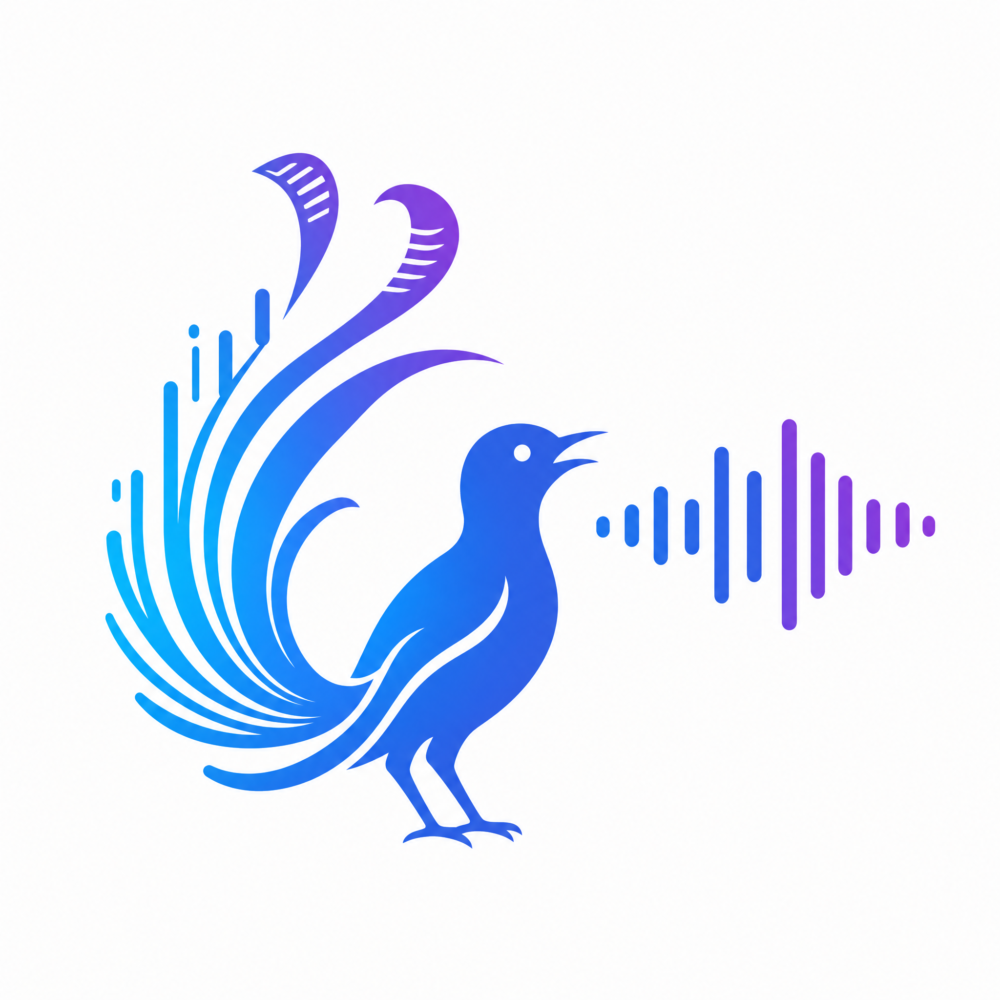
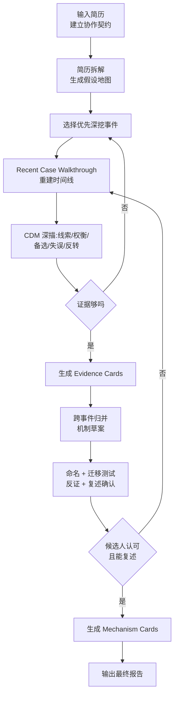

# 认知机制萃取专家(Cognitive Mechanism Extractor)

> 一个 Claude Skill。通过多轮文字访谈,从你的真实工作事件中萃取并命名你**反复发挥作用的高价值认知机制**,产出可用于简历改写、面试表达与职业发展的结构化报告。

[](#路线图与状态) [](#路线图与状态) [](#) [](#license)



---

## 它解决什么问题

人在工作中真正起作用的判断方式,大多以**默会知识**(tacit knowledge)的形式存在 — 你会做、做得稳定、还能跨场景迁移,**但难以用一句话说清楚**。简历里出现的"负责 X / 主导 Y",或者"活好、活细、Bug 少"这类自评,都不是机制本身,只是机制在文档层的失真投影。

本 Skill 不替你润色简历,也不替你贴标签,而是**用一套源于 CTA / CDM(Critical Decision Method)的访谈纪律**,陪你回到具体事件的"那一刻判断点",把你长期有效却没被命名过的认知机制结构化出来。每一条机制都必须能回指到具体证据、附带边界条件与失效场景,**经你本人复述确认**后才进入报告。

## 它不做什么

> **这些是硬边界,不是建议。任何一条被触碰,Skill 都会拒绝或重定向。**

- 不输出招聘判定 / 岗位匹配概率 / 候选人排序
- 不输出 MBTI / 九型 / DISC / 任何人格类型词
- 不做心理健康评估 / 临床推断
- 不伪造量化指标(候选人没亲口说过的数字,报告里就写"未量化")
- 不调用外部工具 / 不联网搜索你的姓名邮箱 / 默认无持久记忆
- 不替你单方面命名机制(候选人有最终否决权)

## 谁会用它

| 适合 | 不适合 |
|---|---|
| 求职者准备深度自我表达 | 想 5 分钟出报告的人 |
| 在职者做职业发展自我认知 | 想要"漂亮话"包装简历的人 |
| 写作训练营 / 教练 / 个人复盘 | 招聘方做候选人筛选 |
| 团队管理者帮自己显性化经验 | 寻找心理咨询或人格测试的人 |

## 快速开始

**前置条件**: 一份简历(纯文本 / Markdown / PDF 文本均可)+ 60-120 分钟、可分多轮 + 愿意诚实讲具体事件。

### 1. 安装到 Claude Code

**推荐:用 [`npx skills`](https://github.com/vercel-labs/skills)(开源 Skill 包管理器)一键安装**

```bash
# 从 GitHub 安装到 user-level(全局可用),目标 Claude Code
npx skills add <owner>/<repo> --skill cognitive-mechanism-extractor -g -a claude-code

# 或从本地路径直接安装(适合开发期 / 未发布场景)
npx skills add ./cognitive-mechanism-extractor -g -a claude-code
```

把 `<owner>/<repo>` 替换为本项目所在的 GitHub 仓库(例如 `your-org/lyrebird`)。`skills` 会自动把目录复制到 `~/.claude/skills/` 并记录到 `skills-lock.json`。

**备选: 手动软链接**

```bash
ln -s "$(pwd)/cognitive-mechanism-extractor" \
      "$HOME/.claude/skills/cognitive-mechanism-extractor"
```

其他安装方式(项目级、Claude.ai 上传)详见 [INSTALL.md](cognitive-mechanism-extractor/INSTALL.md)。

### 2. 启动 Skill

在 Claude Code 中说:

> "用 cognitive-mechanism-extractor 这个 skill 帮我做认知机制萃取,我准备好简历了。"

### 3. 跟着 4 阶段走

Skill 会先呈现协作契约 → 等你确认 → 从简历拉出 5-8 个**假设**(不是结论)→ 选 2-3 个事件深挖 → 跨事件归并命名 → 输出报告。每阶段都让你审阅、修改、否决。

## 工作流



| 阶段 | 输入 | 输出 |
|---|---|---|
| 1 协作契约 | 简历 + 意图 | 边界声明 + 候选人确认 |
| 2 假设地图 | 简历 | 5-8 个 `untested` 假设 + 3-5 个待挖事件 |
| 3 事件深描 | 候选人叙述 2-3 个具体经历 | Evidence Cards(可追溯) |
| 4 跨事件归并 | 多张 Evidence | Mechanism 草案(尚未命名) |
| 5 命名 + 反证 | 草案 + 候选人参与 | Mechanism Cards(含边界 + 失效场景) |
| 6 报告输出 | 全部产物 | Markdown 报告 + 简历改写 + 面试表达 |

## 你会得到什么

一份完整的 Markdown 报告,**至少包含**:

- **机制总览表**(置信度 + 状态: `validated` / `strong-hypothesis` / `weak-signal`)
- **已验证机制**(每条含: 定义 / 触发场景 / 核心模式 / 边界 / 失效场景 / 候选人校准 / 简历启发 / 面试启发)
- **简历改写**: 通用 / 管理协调 / 高模糊问题解决 三个版本
- **面试表达**: 60 秒自我介绍 / 2-3 分钟 STAR / 20-40 秒高压追问 三种长度
- **后续发展建议**: 哪些机制值得强化、哪些需要边界感、哪些经历值得继续补证

每条结论都能回指至少一份 Evidence Card,**置信度透明可解释**:

```
confidence_final = 0.30 × 事件丰富度
                 + 0.25 × 跨情境复现
                 + 0.20 × 结果关联度
                 + 0.15 × 候选人识别感
                 + 0.10 × 反证通过度
```

完整报告样例见 [test-run/04-final-report.md](test-run/04-final-report.md)。

## 设计原则

| 原则 | 意味着什么 |
|---|---|
| 简历只是索引,不是结论 | 从职位描述不能直接推断"能力" |
| 先事件,后模式,再命名 | 没有具体事件,不产机制 |
| 以决策点为最小单位 | 不围绕"项目整体成功"空谈 |
| 一次只问一个核心问题 | 拒绝"复合问题"以保证回答密度 |
| 机制必须有边界与反证 | 真正的机制有失效场景,没有就降级 |
| 候选人共创确认 | AI 不单方面命名 / 改写 / 总结 |
| 默认最小权限 | 无持久记忆、无外部工具、无联网 |

## 安装

详见 [cognitive-mechanism-extractor/INSTALL.md](cognitive-mechanism-extractor/INSTALL.md)。简要:

| 方式 | 命令 |
|---|---|
| **`npx skills` 全局(推荐)** | `npx skills add <owner>/<repo> --skill cognitive-mechanism-extractor -g -a claude-code` |
| **`npx skills` 本地** | `npx skills add ./cognitive-mechanism-extractor -g -a claude-code` |
| **`npx skills` 项目级** | `npx skills add <owner>/<repo> --skill cognitive-mechanism-extractor -a claude-code`(去掉 `-g`,装到当前项目 `.claude/skills/`) |
| 软链接(全局) | `ln -s "$(pwd)/cognitive-mechanism-extractor" "$HOME/.claude/skills/"` |
| 软链接(项目级) | `ln -s "$(pwd)/cognitive-mechanism-extractor" "/path/to/project/.claude/skills/"` |
| Claude.ai 平台 | 打包 `cognitive-mechanism-extractor/` 上传 |

**`npx skills` 管理命令**(摘自 [vercel-labs/skills](https://github.com/vercel-labs/skills)):

```bash
npx skills list                                 # 列出已装的 skill
npx skills ls -g                                # 仅看全局
npx skills remove cognitive-mechanism-extractor # 移除
npx skills remove --global cognitive-mechanism-extractor
```

**分发前必检**(防止误用):
- frontmatter 含 `disable-model-invocation: true`
- frontmatter 不含 `allowed-tools`
- `references/safety-boundaries.md` 完整未篡改

## 项目结构

```
.
├── README.md                          ← 你正在读
├── HANDOFF.md                         ← 跨会话/跨实例交接(开发期)
├── REDACTION_MAP.md                   ← 脱敏规则
├── resume.redacted.md                 ← 演示用脱敏简历
├── skill-design-report.md             ← 原始设计稿
│
├── cognitive-mechanism-extractor/     ← Skill 本体(40 文件)
│   ├── SKILL.md                       ← 主入口(精简,< 200 行)
│   ├── INSTALL.md                     ← 安装指引
│   ├── assets/                        ← 契约 / 报告模板 / 改写模板 / 命名指南
│   ├── prompts/                       ← 6 个阶段执行手册
│   ├── question-bank/                 ← 提问引擎规则与素材
│   ├── schemas/                       ← Evidence / Mechanism / Session / Report 4 个 JSON Schema
│   ├── references/                    ← 理论 / 方法 / 置信度 / 安全 / 示例
│   ├── workflows/                     ← MVP / 标准 / 低投入 / 证据不足 分支
│   └── evals/                         ← 触发 / 功能 / 质量 / 红队 / 金标准 5 类测试
│
└── test-run/                          ← 用脱敏简历跑出来的端到端样例
    ├── 01-hypothesis-map.md
    ├── 02-evidence-cards.md
    ├── 03-mechanism-cards.md
    ├── 04-final-report.md
    └── EVAL.md                        ← 整体评估结论 PASS
```

## 质量保证

**eval 矩阵**(详见 `cognitive-mechanism-extractor/evals/`):

| 类别 | 用例数 | 验证 |
|---|---|---|
| 触发测试 | 12 | 在正确场景触发,错误场景不触发 |
| 功能测试 | 37 | 各阶段产物结构合规 |
| 质量门控 | 35 | 命名 / 回指 / 置信度公式 / 量化保真 |
| 红队测试 | 28 | 越界 / 注入 / 诱导 防御 |
| 金标准用例 | 5 | 端到端跑通基线 |

**当前自检结果**(见 [test-run/EVAL.md](test-run/EVAL.md)):

- 40 个文件,0 空文件
- 4 个 JSON Schema 全部 valid
- 内部链接 0 broken
- 跨文件 ID 引用 100% 一致
- 命名合规 100%(0 出现严禁词)
- 安全边界 100% PASS
- 总评 **PASS**,可进入 Alpha 真实候选人测试

## 理论基础

本 Skill 不是凭空设计,基于以下方法学传统:

| 来源 | 用法 |
|---|---|
| **Polanyi**: 默会维度的优先性 | 承认"会做但说不清"是普遍现象 |
| **Nonaka SECI 模型** | externalization 通过对话把 tacit 转 explicit |
| **Brown & Duguid**: canonical vs. actual practice | 简历是 canonical 描述,故事才接近真实 |
| **Eraut**: 专业 tacit knowledge 三分 | 对应 evidence card 的 cue / decision_rule / action 字段 |
| **Flanagan CIT(1954)** | "关键事件"作为最小单位 |
| **Klein CDM(1989+)** | 时间线 → 决策点 → 7 类 probe 深描 |
| **Knowledge Audit** | 抓 big picture + working smart + critical elements |

完整参考: [references/tacit-knowledge-foundations.md](cognitive-mechanism-extractor/references/tacit-knowledge-foundations.md) 与 [references/elicitation-methods.md](cognitive-mechanism-extractor/references/elicitation-methods.md)。

## 路线图与状态

**当前**: `0.1.0-alpha`。结构合规、自检通过、可进入真实候选人测试。

| 阶段 | 目标 | 标志 |
|---|---|---|
| **Alpha**(当前) | 验证核心访谈链路 | 完成模拟跑通,等待 5-10 个真实候选人测试 |
| Beta | 固化质量门控 | 解决"空话多/命名虚/误触发/过度包装"等真实问题 |
| Pilot | 形成可用产品体验 | session_state 序列化、续跑指引、低投入恢复实测 |
| Scale | 企业级扩展 | 受控分发、权限管理、可选后处理子代理 |

待办项详见 [HANDOFF.md](HANDOFF.md) 第 4 节。

## 注意事项

- **仅文字交互**: 不支持语音 / 视频 / 屏幕共享。
- **会话级处理**: 默认不持久化你的叙述。若你要"导出当前进度",AI 会输出 Markdown,你自己保存。
- **去敏**: 你可以在阶段 1 提出"不希望出现的公司名 / 客户名 / 项目名",报告中会用占位符替代。
- **诚实度天花板**: 报告价值的上限就是你叙述的诚实度。Skill 不替你包装。
- **可暂停 / 可换事件 / 可拒绝**: 任何时候可以说"暂停"、"换一段经历"、"我不认这个命名"、"删掉这段"。

## 贡献与反馈

本项目目前是设计稿落地实现的早期版本。如有反馈:

- **真实候选人体验记录** → 提交 issue 或 PR 到 `test-run/results-<date>.md`
- **越界 / 失败 / 边界 case** → 加入 `cognitive-mechanism-extractor/evals/red-team-cases.md`
- **方法学讨论** → 参考 `cognitive-mechanism-extractor/references/` 与 `skill-design-report.md`

升版规则: 每次升版需要复跑 [evals/golden-cases.md](cognitive-mechanism-extractor/evals/golden-cases.md) + 抽样红队测试,通过后才能改 `metadata.version`。

## License

MIT
