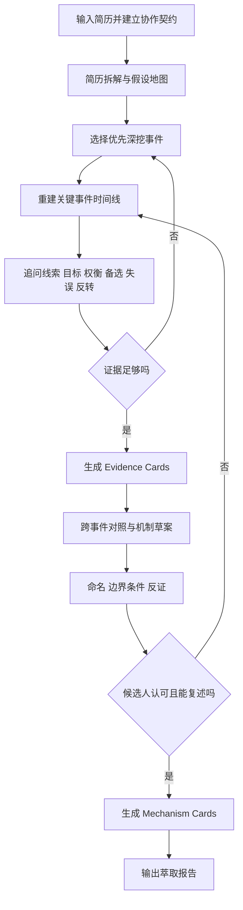

# 认知机制萃取专家 Skill 原则与架构设计方案

## 执行摘要

这份方案建议把“认知机制萃取专家”设计成一个**手动触发、纯文字互动、单主代理优先、证据可追溯、按需加载上下文**的 Skill，而不是一个泛化的“职业教练 Prompt”。其核心任务不是替候选人贴标签，而是把简历背后那些难以一下说清、但在真实工作中反复发挥作用的**线索读取方式、问题建模方式、权衡判断方式、推进路径与复盘抽象方式**，从默会层面转译成候选人可以理解、认可、复述、迁移的“认知机制卡”。这种设计既契合波兰尼关于“人所知道的常常超过其可完整言说的范围”的默会知识起点，也契合 Nonaka 对 tacit–explicit 持续转化的组织知识观，以及 CTA/CDM/CIT 这类通过具体事件重建专家判断过程的方法学传统。citeturn14search1turn12view1turn13view0turn29view1turn37view1turn41search0

从 Anthropic 的官方 Skill 实践看，最稳妥的落地方式不是做一个巨大的单体提示词，而是遵循 **progressive disclosure**：把触发说明放在 frontmatter，把核心流程放在 `SKILL.md`，把问题库、rubric、schema、报告模板等重材料放在 linked files 中按需读取；同时坚持“**简单、可组合、可测试**”的代理设计，而不是一上来就做复杂多代理编排。Anthropic 的官方文档与工程文章明确指出，Skill 的描述信息会预装入上下文，正文在相关时再加载；正文一旦加载，又会在会话中持续占用上下文，因此 `SKILL.md` 必须精简，复杂内容应拆到 supporting files 中；Anthropic 对 agent 的总体建议也是优先选择最简单、最可调试的模式。citeturn18view0turn2view0turn5view2turn5view3turn31view3turn36view0turn36view1

本方案的关键判断有六个：其一，**简历只是“假设地图”，不是证据本体**；其二，**先事件、后模式、再命名**；其三，**每个机制必须能回指到证据卡，而不是停留在形容词**；其四，**每个机制都要写出边界条件、失效场景与反证**；其五，**默认不做持久记忆与外部工具调用**，以降低隐私与技能供应链风险；其六，**MVP 先做单 Skill、单流程、单报告模板**，在验证提问质量和候选人“识别感”之后，再考虑自动评审、可选子代理和产品化界面。Anthropic 官方还特别提醒，恶意 Skill 可能引导数据外流或执行危险操作；近来的 Skills 安全研究预印本也指出，Skill 生态存在显著的语义供应链攻击面，因此对这类涉及候选人敏感叙述的 Skill，最小权限与可信分发应当是默认前提。citeturn18view0turn19view3turn23search0turn23search1

下面的方案不是直接实现代码，而是一份可以据此创建 Skill 的**设计蓝图**：包含目标与定位、设计原则、完整文件/模块架构、主工作流、提问引擎规则、证据卡与机制卡 schema、命名规则、质量门控、MVP 产出、Markdown 报告模板，以及与 Anthropic Skill 最佳实践的对接方式。

| 设计问题 | 推荐答案 |
|---|---|
| 触发方式 | 手动触发为主，避免误触发 |
| 主体架构 | 单主 Skill 行内运行，子代理只作可选后处理 |
| 交互媒介 | 仅文字，多轮深挖 |
| 初始材料 | 简历；其他文本材料为可选补证 |
| 证据中间层 | `evidence card` |
| 机制中间层 | `mechanism card` |
| 最终产物 | 萃取报告 + 简历改写建议 + 面试表达建议 |
| 默认权限 | 无持久记忆、无外部调用、无招聘判定、无心理诊断 |
| 运行平台 | 未指定 |
| 数据保留策略 | 未指定 |

## 研究基础与约束边界

### 理论起点

默会知识研究的共同起点，是承认**工作中的高价值能力并不总能以“我擅长 X”这种显性语言直接给出**。波兰尼在《The Tacit Dimension》中把这个问题表述为：人的认识往往超过其可完整陈述的范围；中文学术语境中，南京大学转载的研究也把“默会维度的优先性”理解为对“完全明确知识理想”的修正，强调明确知识背后存在默会根源。也就是说，真正有价值的萃取，不是把候选人的自我评价抄一遍，而是帮助其把“会做、会判断、会拿捏”的内部过程外显出来。citeturn14search1turn33view0

Nonaka 的组织知识创造理论进一步把 tacit–explicit 的转化机制说清楚了：知识创造不是简单记录，而是 tacit 与 explicit 的持续对话；四种经典转化模式是 socialization、externalization、combination、internalization，其中 externalization 尤其依赖有意义的对话来把原本难言的判断过程说出来。这个观点对于纯文字 Skill 很关键，因为它说明：**AI 能做的不是“替人总结优点”，而是设计一套对话结构，让候选人在事件复盘、对比、命名、修订中完成外化。**citeturn12view1turn13view0turn13view2

Brown 与 Duguid 对工作实践的研究又补上了一个在候选人萃取里极其重要的提醒：组织的正式描述、培训手册和岗位说明常常与人们真实完成工作的方式相差很大，很多有效的 improvisation、workaround 和非典型做法，恰恰是绩效与创新的来源。他们还指出，许多应对复杂情景的技能，实际是通过社区叙事和经验故事被发展和保存的。这意味着：**简历的职责描述不是机制本身，候选人的“故事”才更接近机制本身。**citeturn38view0

Eraut 对专业工作中的 tacit knowledge 做了更贴近职场的拆分：他区分了对人和情境的 tacit understanding、被熟练化的 routinized actions，以及支撑直觉判断的 tacit rules；这些要素常常在时间压力、复杂度和经验差异中一起发挥作用。这个拆分非常适合直接转成 Skill 的证据捕捉框架：我们不只记录“做了什么”，还记录“看到了什么”“凭什么判断”“默认规则是什么”“在哪些场景失效”。citeturn26search3turn26search7

### 方法学起点

如果目标是用文字把“做事背后的思维”挖出来，那么比一般半结构化访谈更合适的，是 CTA、CDM、CIT 这一路的方法。Flanagan 的 Critical Incident Technique 把关键事件界定为对结果有明显正负影响的具体行为片段，并强调用具有方法标准的程序去收集这些事件；Klein 等人的 Critical Decision Method 则进一步把这套方法延伸到高压、信息量大、条件变化快的真实决策情境中，专门用 probe 去追问关键线索、知觉区分、概念区分、典型性判断和情境评估依据。citeturn41search0turn29view1

CTA 近年来被更系统地用于访谈式研究。SAGE 的方法论文直接把 CTA 定义为一种用于识别复杂工作任务背后认知过程与技能的访谈型定性方法，并明确把 CTA 拆成三阶段：knowledge elicitation、data analysis、knowledge representation。另一个开放获取的系统综述则回顾了 81 篇相关研究，指出 CTA 方法确实常被用来**eliciting、documenting、sharing tacit knowledge**，尤其适用于时间稀缺、复杂、不确定的专业场景；其中最常见的就是 CDM 与各类 CTA 访谈。citeturn37view1turn37view0

对纯文字 Skill 尤其有用的是 CTA 的两个轻量化组件。其一是 **Recent Case Walkthrough**：它是 CDM 的简化版，目的是快速进入领域并建立 rapport，先让受访者讲“最近一次具体问题”，再一起构建时间线，随后逐点追问当时需要的信息、来源、使用方式以及心智建模。其二是 **Knowledge Audit**：它会追问受访者在任务里如何保持“大图景”、如何“working smart”、如何在更少资源下做出更高效的判断。二者组合起来，几乎就是一个文字版“知识萃取专家”的天然骨架。citeturn30view0turn30view1

### 设计约束与未指定项

本方案严格服从以下明确约束：只做文字交互；候选人承诺多轮投入；不使用语音、视频、屏幕共享；不做招聘决策、不做心理诊断；输入至少包含简历；最终输出是可以指导简历修改、后续面试表达和能力显性化的萃取报告。未被明确给出的平台、模型、保留周期、部署边界，应在实现前补齐；在这之前，以下项目统一标记为“未指定”。

| 项目 | 状态 | 建议默认值 |
|---|---|---|
| 运行平台 | 未指定 | Claude.ai 或 Claude Code 均可；MVP 先选一个 |
| 简历格式 | 未指定 | 纯文本 / Markdown / PDF 文本提取 |
| 补充材料 | 未指定 | 允许候选人粘贴去敏文本片段，非强制 |
| 数据保留周期 | 未指定 | 默认会话级；不持久化 |
| 是否跨会话记忆 | 未指定 | 默认关闭 |
| 多语言支持 | 未指定 | 以中文为主；必要时支持双语输出 |
| 企业内部分发方式 | 未指定 | 私有仓库 / 受控工作区发布 |

## 目标定位与设计原则

### 目标与非目标

这个 Skill 的目标，不是判断“这个人能不能被录用”，也不是建立一个人格画像，而是帮助候选人把自身在工作中反复有效、但尚未被精确命名的高价值认知机制萃取出来，并转成三类可直接使用的资产：**简历语句、面试表达、职业发展自我认知**。这与 Sternberg 一路关于 tacit knowledge 及 practical intelligence 的职场研究方向是同频的：真正与工作表现相关的，常常是那些在真实情境中习得、却未被正式教授的 practical know-how。citeturn43search0turn42search0turn43search17

因此，本 Skill 的**非目标**也必须写得很硬：不输出“适配岗位概率”“优于其他候选人”“人格类型”“心理健康标签”“IQ 推断”“临床倾向”之类结论；不把一次访谈生成的机制当作稳定人格；不把候选人叙事中的单一高光时刻夸大成普适能力；不伪造量化结果或工作影响。Anthropic 的官方测试与评估指南也反复强调，成功标准要具体、可测、与真实任务相关，而不是模糊地说“效果好”；这种边界写法本质上也是为了减少高风险误用。citeturn7view0turn36view2

### 设计原则

本报告建议采用以下原则来定义 Skill 行为。每一条都不是口号，而是会落实到文件结构、提问规则和质量门控中的具体约束。

| 原则 | 具体含义 | 设计落点 |
|---|---|---|
| 简历只是索引，不是结论 | 不从职位描述直接推断“能力词” | 简历阶段只产出“假设清单” |
| 先事后理，先例后名 | 先拿到具体事件，再谈模式与名称 | 每个机制必须回指多个事件 |
| 以决策点为最小单位 | 不围绕“项目整体成功”空谈 | 问题围绕关键判断瞬间展开 |
| 一次只深挖一个认知动作 | 防止问题过宽、回答泛化 | 单轮尽量只问一个核心 probe |
| 机制必须可迁移 | 不是“这个项目里的技巧”而是可跨情境复用的模式 | 要有 transfer probe |
| 机制必须有边界 | 真正的机制有适用条件与失效场景 | 每张机制卡写 failure mode |
| 候选人共创确认 | 命名不是 AI 独断，而是共同校准 | 命名阶段要求候选人复述与修订 |
| 默认最小权限 | 处理敏感叙事时降低外部依赖 | 无持久记忆、无外部调用、少工具 |

这些原则与 Anthropic 的官方建议是高度一致的。Anthropic 一方面强调：最有效的 agent 系统一般采用简单、可组合的模式，而不是复杂框架；另一方面又强调 context 是有限资源，好的设计要用尽可能少而高信号的 tokens 来驱动行为；Skill 层面则通过 frontmatter、正文和 supporting files 的三层结构实现按需加载。对于知识萃取这种多轮长对话任务，这种“少而准的主上下文 + 大量按需参考材料”的架构尤其重要。citeturn36view0turn36view1turn18view0turn3view0

### 架构选型比较

在 Anthropic 的 agent 设计语境里，先问“**是不是一定要复杂**”比先问“能不能做得更炫”更重要。对于本 Skill，我建议的结论非常明确：**MVP 不采用多代理主架构**，而采用“一个主 Skill + 模块化引用文件 + 可选后处理子代理”的方式。这个判断直接响应了 Anthropic 的“从最简单可行方案开始”的建议。citeturn36view0turn31view0

| 方案 | 优点 | 风险 | 结论 |
|---|---|---|---|
| 单一超长 Prompt | 上手快 | 上下文膨胀、版本难管、难测试 | 不推荐 |
| 单体 Skill，所有内容都写进 `SKILL.md` | 便于集中编辑 | 触发后长期占用上下文、问题库难维护 | 不推荐 |
| 模块化 Skill + linked files | 兼顾清晰、可维护、可测试 | 需要更精细的导航设计 | **推荐** |
| 多代理主流程 | 可以并行分析 | 对 MVP 过度复杂，调试难、风险高 | 暂不推荐 |
| 主 Skill + 可选后处理子代理 | 兼顾简单与扩展性 | 需要清楚定义调用边界 | **作为后续增强** |

对本场景来说，主 Skill 应该始终在主会话中运行，因为它必须持续利用候选人的上下文、前文回答和协作契约；Anthropic 文档中 `context: fork` 的子代理模式会隔离会话历史，更适合“已准备好明确任务和材料后的独立研究或总结”，所以它最多只适合用于**后处理**，例如：根据已结构化的 `evidence cards` 做命名一致性检查、报告 QA 或重复机制合并，而不适合承担核心访谈。citeturn19view2turn19view4

## 文件与模块架构

### 总体目录设计

Anthropic 的官方文档明确说明：Skill 的最小单位是一个包含 `SKILL.md` 的目录；`description` 是触发关键；正文在激活时加载；supporting files 应由 `SKILL.md` 明确引用；官方构建指南还建议把大段解释、示例、模板、参考材料移出主文件，不在 skill 文件夹里塞 README，并把 `SKILL.md` 保持精简。基于这些约束，本方案建议下面这套目录。citeturn2view0turn5view0turn5view2turn31view2turn31view3

```text
cognitive-mechanism-extractor/
├── SKILL.md
├── assets/
│   ├── candidate-contract.md
│   ├── report-template.md
│   ├── resume-rewrite-template.md
│   ├── interview-answer-template.md
│   └── naming-style-guide.md
├── prompts/
│   ├── intake-and-contract.md
│   ├── resume-hypothesis-map.md
│   ├── incident-deep-dive.md
│   ├── cross-case-synthesis.md
│   ├── naming-and-validation.md
│   └── final-report-assembly.md
├── question-bank/
│   ├── resume-probes.md
│   ├── critical-incident-probes.md
│   ├── cue-and-judgment-probes.md
│   ├── contradiction-probes.md
│   ├── transfer-probes.md
│   └── anti-leading-rules.md
├── schemas/
│   ├── evidence-card.schema.json
│   ├── mechanism-card.schema.json
│   ├── session-state.schema.json
│   └── report-outline.schema.json
├── references/
│   ├── tacit-knowledge-foundations.md
│   ├── elicitation-methods.md
│   ├── anthropic-skill-practices.md
│   ├── confidence-rubrics.md
│   ├── safety-boundaries.md
│   └── examples/
│       ├── evidence-card-sample.md
│       ├── mechanism-card-sample.md
│       └── report-sample.md
├── workflows/
│   ├── mvp-flow.md
│   ├── standard-flow.md
│   ├── low-engagement-recovery.md
│   └── insufficient-evidence-retry.md
└── evals/
    ├── trigger-tests.md
    ├── functional-tests.md
    ├── quality-gate-tests.md
    ├── red-team-cases.md
    └── golden-cases.md
```

### 模块责任划分

| 模块 | 责任 | 何时加载 | 备注 |
|---|---|---|---|
| `SKILL.md` | 触发说明、主流程、导航 | 技能触发时 | 只放核心规则 |
| `prompts/` | 分阶段执行提示 | 对应阶段按需 | 避免主文件过重 |
| `question-bank/` | 提问引擎素材 | 深挖阶段按需 | 便于版本迭代 |
| `schemas/` | 结构化约束 | 内部记录/校验时 | 支持一致输出 |
| `references/` | 理论与 rubric | 需要解释或校验时 | 支持 progressive disclosure |
| `assets/` | 模板与风格规范 | 报告阶段与命名阶段 | 候选人可见产物多在此 |
| `workflows/` | 流程分支 | 特殊情况时 | 例如低投入、证据不足 |
| `evals/` | 触发/质量/安全测试 | 开发与迭代时 | 不进入候选人交互主流程 |

### 推荐的 `SKILL.md` 示例片段

Anthropic 官方说明里，`description` 用于判断何时使用，`when_to_use` 用于补充触发语境，`disable-model-invocation: true` 适合那些不希望模型自行误触发的流程；同时 `user-invocable: false` 可以隐藏背景知识型 Skill，但本场景显然需要候选人主动启动。官方 docs 还指出，`description + when_to_use` 存在长度截断，因此 frontmatter 必须短、准、可操作。citeturn5view0turn5view2turn19view3

```md
---
name: cognitive-mechanism-extractor
description: 帮助候选人或职场人通过多轮文字互动，萃取其在真实工作中反复起作用的高价值认知机制，并输出可用于简历修改、面试表达和职业发展的结构化报告。
when_to_use: 仅当用户明确希望进行深度、发展型、非招聘评判的认知机制萃取时使用。输入通常包含简历，过程需要多轮投入。不要在普通简历润色、翻译、岗位匹配、人格分析、心理诊断场景中调用。
disable-model-invocation: true
user-invocable: true
metadata:
  interaction_mode: text_only
  diagnosis: forbidden
  hiring_decision: forbidden
  memory_default: none
---

# 认知机制萃取专家

## 任务目标
你的任务不是判断候选人是否优秀，也不是给出人格标签。
你的任务是帮助对方从具体事件中看见、命名并验证自己的高价值认知机制。

## 核心工作法
按以下顺序工作：
1. 建立协作契约
2. 从简历生成假设地图
3. 用关键事件深描去验证或推翻假设
4. 生成 evidence cards
5. 归并为 mechanism cards
6. 与候选人共同完成命名、边界校准与报告输出

## 导航
- 访谈契约见 [assets/candidate-contract.md](assets/candidate-contract.md)
- 分阶段提示见 [prompts/](prompts/)
- 深挖问题库见 [question-bank/](question-bank/)
- 结构化 schema 见 [schemas/](schemas/)
- 质量门控见 [references/confidence-rubrics.md](references/confidence-rubrics.md)
- 最终报告模板见 [assets/report-template.md](assets/report-template.md)
```

### 权限与记忆策略

基于 Anthropic 对 Skills 安全的提醒，以及 `allowed-tools` 会为 Skill 预授权工具的机制，本 Skill 的 MVP 版本**不建议配置任何额外工具预授权**；如果平台支持会话级或用户级记忆，也建议默认关闭持久记忆。Anthropic 的 subagent 文档写得很直白：用户级 memory 会在 `~/.claude/agent-memory/` 中持久保存 learnings；对于敏感候选人叙事，这样的默认设置并不合适。citeturn18view0turn19view3turn5view4

## 主工作流与提问引擎

### 访谈流程与阶段

CTA 的一般结构是 knowledge elicitation、data analysis、knowledge representation；而 Recent Case Walkthrough、CDM 和 Knowledge Audit 则分别提供了“进入场景—重建事件—深挖线索—提取 big picture 与捷径”的操作顺序。本方案把这些方法统一改写成一个适合纯文字互动的流程。citeturn37view1turn30view0turn30view1turn29view1



### 分阶段输入输出

| 阶段 | 输入 | 核心动作 | 输出 | 该阶段禁止的动作 |
|---|---|---|---|---|
| 协作契约 | 简历 + 用户意图 | 说明边界、确认投入、说明不做招聘/诊断 | `session_contract` | 直接下能力结论 |
| 简历假设图 | 简历文本 | 拆职责、结果、转折、缺口；生成待验证机制假设 | `hypothesis_map` | 把简历词等同于机制 |
| 关键事件深描 | 1–3 个具体经历 | 重建时间线，锁定判断点、信号、备选、行动、结果 | 原始访谈材料 | 抽象评价式总结 |
| 证据卡生成 | 访谈片段 | 把具体叙事转成可引用证据单元 | `evidence_cards` | 先命名、后补证 |
| 跨事件归并 | 多张证据卡 | 找复现模式、共性线索和边界差异 | `mechanism_drafts` | 忽略反证 |
| 命名与反证 | 机制草案 | 共同命名、做迁移测试、识别失效场景 | `mechanism_cards` | 贴人格标签 |
| 报告输出 | 机制卡 + 证据卡 | 生成报告、简历语句、面试表达建议 | 最终 Markdown 报告 | 伪造量化结果 |

### 提问引擎的硬规则

Anthropic 的 prompting 与 context engineering 文档都强调，系统提示要明确、直白、分段，避免既含混又过度复杂；而 CTA/CDM 的价值，则在于它不是“你觉得自己怎样”的发问，而是让人回到一个具体瞬间去重演判断过程。因此，提问引擎必须被写成一个**严守顺序的规则系统**，而不是一组松散题目。citeturn21view0turn36view1turn29view1turn30view0

| 规则 | 解释 | 典型执行语句 |
|---|---|---|
| 一次只问一个核心问题 | 减少回答泛化，保持深描密度 | “先只讲当时你第一次意识到不对劲的那个瞬间。” |
| 先要事件，不要观点 | 禁止从“我比较有 owner 意识”开挖 | “先不要总结自己，给我一个最近的具体经历。” |
| 先时间线，再解释 | 防止叙事后见之明污染 | “按先后顺序说，你先看到了什么，然后做了什么？” |
| 锁定决策点 | 让机制落在判断而非项目流水账 | “那一刻你是怎么判断该停止还是继续的？” |
| 追问情境线索 | 捕捉 tacit cues | “别人也看到了这些信息，但你额外注意到了什么？” |
| 追问备选方案 | 萃取权衡规则 | “你当时差点选另一个做法吗？为什么没有？” |
| 追问 big picture | 捕捉高阶框架 | “你脑中一直在守住的那个总目标是什么？” |
| 追问 working smart | 捕捉经验捷径 | “这件事里你后来形成了什么省力但有效的判断窍门？” |
| 强制反证 | 防止机制神化 | “有没有一次你照这个方式做，结果反而不好？” |
| 强制迁移测试 | 判断是否可迁移 | “换成你没有权威、资源更少的场景，这套做法还成立吗？” |
| 强制候选人校准 | 防止 AI 擅自命名 | “这个名字像你，还是只是像我在替你包装？” |

### 提问引擎的推荐顺序

从实践上，最稳妥的顺序不是“完整 STAR + 大段总结”，而是下面这条链路：  
**Recent Case Walkthrough → 决策点定位 → CDM 深描 → Knowledge Audit → 跨事件对照 → 命名校准**。  
这样设计，是因为 Recent Case Walkthrough 本身就被定义为进入领域和建立 rapport 的简化 CDM；CDM 负责把关键线索与判断依据挖出来；Knowledge Audit 再把“大图景”“working smart”“关键元素”补齐；最后才进入跨事件对照和机制命名。citeturn30view0turn29view1turn30view1

### 问题库示例

下表不是完整问题库，而是 MVP 应优先放进 `question-bank/` 的高频问题类型。它们覆盖了简历导入、关键事件、线索识别、权衡、边界、迁移和命名几个核心维度。

| 问题类别 | 示例问题 | 主要萃取对象 |
|---|---|---|
| 简历破题 | “这份简历里，哪段经历最容易被低估，但其实最能代表你？” | 高价值样本优先级 |
| 职责反差 | “这段经历里，最不像你岗位说明书的一件事是什么？” | 非正式实践 |
| 最近案例 | “先讲最近一次你真正做了判断，而不是只是执行安排的事。” | 事件锚点 |
| 时间线 | “从事情刚出现到你采取行动，按顺序写给我。” | 因果顺序 |
| 信号识别 | “你最早注意到的异常信号是什么？别人当时注意到了吗？” | 弱信号与线索 |
| 备选权衡 | “当时你脑中至少有哪两个方案？你怎么排除掉另一个？” | 权衡规则 |
| big picture | “整个过程中你最怕失去控制的关键变量是什么？” | 全局框架 |
| working smart | “你后来形成了什么‘不用每次都重想一遍’的经验套路？” | tacit rule / heuristic |
| 失误与修正 | “有没有一次你判断错了？你后来怎么修正自己的判断规则？” | 修正机制 |
| 迁移测试 | “如果把资源砍掉一半，这个做法还能成立吗？” | 可迁移性 |
| 角色对照 | “你和同事在同一信息下，通常分歧点会出现在哪里？” | 独特认知差异 |
| 命名校准 | “下面三个名字，你更认哪一个？或者你想改成什么？” | 候选人识别感 |

### 纯文字场景下的特别规则

由于没有语音、视频、表情、桌面共享，纯文字 Skill 必须用更强的结构来弥补感知缺失。最重要的补偿方式有三种：  
一是让候选人尽量用**短段落 + 分行时间线**来写事件；  
二是要求每个重大结论都能回到一个**具体时刻**与**具体判断点**；  
三是在命名前做一次“**如果删掉这个机制，你的做法会发生什么变化**”的反事实测试。这样能避免文字访谈滑向空泛鸡汤，也能尽量接近 Brown 与 Duguid 所说的 “actual practice”，而不是停在岗位话术层面。citeturn38view0turn37view1

## 证据结构与质量门控

### 设计证据中间层的原因

Anthropic 对 agent eval 的定义里，区分了 task、trial、grader、transcript、outcome；这实际上提供了一个很有用的思路：**最终报告不应该直接从 transcript 跳到 conclusion，而应该先形成可引用的中间层对象。** 对本 Skill 来说，这个对象就是 `evidence card` 和 `mechanism card`。它们一方面让最终报告可追溯，另一方面也让后续命名、报告生成、质量评审都可以围绕结构化对象进行，而不是反复翻全量对话。citeturn36view2turn7view0turn36view1

### Evidence Card schema

| 字段 | 类型 | 必填 | 说明 |
|---|---|---|---|
| `evidence_id` | string | 是 | 例如 `E-001` |
| `source_type` | enum | 是 | `resume` / `interview` / `followup` / `counterevidence` |
| `stage` | enum | 是 | 来源阶段 |
| `incident_title` | string | 是 | 该事件的短标题 |
| `context` | string | 是 | 背景、约束、角色 |
| `trigger_moment` | string | 是 | 触发判断的具体时刻 |
| `task_or_problem` | string | 是 | 当时要解决的问题 |
| `critical_cues` | array[string] | 是 | 候选人识别到的关键信号 |
| `considered_options` | array[string] | 否 | 当时考虑过的备选方案 |
| `decision_rule` | string | 否 | 当时默认采用的判断规则/经验法则 |
| `action_taken` | string | 是 | 实际动作 |
| `outcome` | string | 是 | 结果；无法量化则写“未量化” |
| `candidate_quote` | string | 是 | 候选人的关键原话或紧凑转述 |
| `interviewer_inference` | string | 是 | Skill 的解释，不可与原话混淆 |
| `relevance_tags` | array[string] | 是 | 如 `signal-reading` / `tradeoff` / `stakeholder` |
| `confidence_self` | number | 否 | 候选人自评把握度，0–1 |
| `confidence_extractor` | number | 是 | Skill 给出的证据把握度，0–1 |
| `related_mechanism_ids` | array[string] | 否 | 与哪些机制草案相关 |
| `sensitivity_note` | string | 否 | 是否需要匿名化/删敏 |

### Mechanism Card schema

| 字段 | 类型 | 必填 | 说明 |
|---|---|---|---|
| `mechanism_id` | string | 是 | 例如 `M-001` |
| `working_name` | string | 是 | 当前机制名称 |
| `one_sentence_definition` | string | 是 | 一句话定义 |
| `mechanism_type` | enum | 是 | `cue-reading` / `problem-framing` / `tradeoff` / `coordination` / `iteration` / `reflection` / `mixed` |
| `core_pattern` | string | 是 | 机制的稳定模式描述 |
| `trigger_contexts` | array[string] | 是 | 常见触发情境 |
| `input_cues` | array[string] | 是 | 机制依赖的关键信号 |
| `internal_operation` | string | 是 | 中间认知动作：拆解、比较、预判、抽象等 |
| `action_signature` | string | 是 | 外显行为长什么样 |
| `value_created` | string | 是 | 该机制产生的价值 |
| `boundary_conditions` | string | 是 | 在什么场景下有效 |
| `failure_modes` | string | 是 | 何时会失效或过度使用 |
| `development_stage` | enum | 是 | `validated` / `strong-hypothesis` / `weak-signal` |
| `evidence_ids` | array[string] | 是 | 正向证据 |
| `counterevidence_ids` | array[string] | 否 | 反证或边界证据 |
| `transfer_scenarios` | array[string] | 否 | 可迁移到哪些场景 |
| `resume_implication` | string | 是 | 对简历写法的启发 |
| `interview_implication` | string | 是 | 对面试表达的启发 |
| `candidate_validation_note` | string | 是 | 候选人是否认可、如何修订 |
| `confidence_final` | number | 是 | 最终置信度 0–1 |

### 命名规则

Nonaka 把 externalization 看作通过对话把 tacit 转成 explicit；Brown 与 Duguid 则提醒我们别被 canonical labels 迷惑。两者合并起来，意味着机制命名必须避免“性格词—胜任力套话—招聘术语”这条最省事也最失真的路，而应该命名成**可观察的认知—判断—行动模式**。citeturn13view0turn13view2turn38view0

| 规则 | 应该做什么 | 不该做什么 | 例子 |
|---|---|---|---|
| 用动作机制命名 | 写“如何思考/判断/推进” | 写抽象赞美词 | “高模糊需求下的结构化澄清机制” |
| 名称里包含情境 | 指出其典型适用场景 | 假装其无处不在 | “跨部门阻力中的最小共识推进机制” |
| 名称里包含认知动作 | 体现拆解、预判、折中、校准 | 只写结果 | “弱信号拼接与前摄干预机制” |
| 名称里包含价值方向 | 说明机制为什么重要 | 只有术语感没有用途 | “多约束条件下的优先级折中机制” |
| 避免人格标签 | 不写“很负责/很有领导力” | 用 MBTI/九型/临床词汇 | “复盘抽象与下轮迭代机制” |
| 允许候选人修名 | AI 给候选名，候选人可改 | AI 一次定名 | “你更认‘结构化澄清’还是‘模糊拆题’？” |

### 质量门控与置信度规则

Anthropic 的官方评估文档强调：一开始就定义成功标准，并为 LLM-based grading 写清楚 rubric；评估时最好既有结构化打分，也有明确的通过/不通过条件。对应到本 Skill，质量门控最重要的不是语言流畅，而是**证据密度、跨事件复现、反证完整性、候选人识别感**。citeturn7view0turn32view0turn36view2

| 置信等级 | 判定条件 | 报告展示方式 | 处理规则 |
|---|---|---|---|
| 高 | 至少 3 张证据卡、覆盖 2 个以上事件、含边界/反证、候选人认可命名 | “已验证机制” | 可进入正式报告摘要 |
| 中 | 至少 2 张证据卡、至少 1 次迁移测试、候选人基本认可 | “有力假设” | 可进入报告，但需标注待补证 |
| 低 | 仅 1 个事件或仅来自简历推断，候选人也难确认 | “弱信号” | 不进入摘要，只放附录或后续追访 |

建议把最终分数写成一个可解释而非神秘的综合值，例如：

`confidence_final = 0.30 × 事件丰富度 + 0.25 × 跨情境复现 + 0.20 × 结果关联度 + 0.15 × 候选人识别感 + 0.10 × 反证通过度`

这个公式不是学术标准，而是本方案的**运营型 rubric**。它的作用不是制造伪精确，而是强迫 Skill 在出结论前检查：是不是只有漂亮话、是不是没有跨事件、是不是没有反证、是不是候选人本人其实并不认。Anthropic 在其 grading 建议中也明确推荐：rubric 要细、输出最好是可机器判读的等级或标签，而不是模糊评价。citeturn7view0

另外，必须设置四道硬门槛：  
**证据硬门槛**：没有具体事件，不产机制。  
**反证硬门槛**：没有边界条件，不产“高置信机制”。  
**识别硬门槛**：候选人说“不像我”，则不能强行保留。  
**安全硬门槛**：一律不输出人格诊断、心理推断、招聘结论。  
这些门槛对减少 Skill 的“包装冲动”比任何语言润色都更重要。citeturn18view0turn36view2

## MVP 产出与报告模板

### MVP 建议流程

Anthropic 的 Skill 指南建议先锁定 2–3 个具体 use cases，再从一个挑战性但清晰的任务开始测试，跑通后再扩展；对本 Skill 来说，MVP 最好只做三件事：**启动深度萃取、补证修正、生成报告**。不要一开始就做岗位匹配、模拟面试、长期成长追踪、跨会话记忆。citeturn31view0turn32view0

| MVP 回合 | 输入 | Skill 行为 | 输出 |
|---|---|---|---|
| 启动回合 | 简历 + 启动意图 | 建立契约，生成假设地图，列出待挖事件 | `hypothesis_map` |
| 深挖回合 | 候选人叙述 2–3 个关键事件 | 事件时间线、CDM 深描、证据卡生成 | `evidence_cards` |
| 归并回合 | 多张证据卡 | 机制草案、命名候选、迁移测试、反证 | `mechanism_cards` |
| 报告回合 | 机制卡 + 候选人校准 | 输出报告、简历改写建议、面试表达建议 | Markdown 报告 |

如果候选人的叙述密度不足，MVP 不应“硬产出完整报告”，而应触发 `insufficient-evidence-retry` 分支；如果候选人投入度不足，报告应降低置信度并明确写“证据不足”。这也符合 Anthropic 关于 eval 中 outcome 与 transcript 区分的思路：**说得好看不等于真的完成任务。**citeturn36view2

### MVP 成功标准

| 指标 | 建议定义 |
|---|---|
| 候选人识别感 | 候选人对每项已验证机制的“像我程度”平均 ≥ 4/5 |
| 证据完整率 | 最终摘要中的机制，80% 以上达到中高置信 |
| 报告可用性 | 至少能直接导出 3 条简历语句与 3 组面试表达 |
| 误触发率 | 对普通简历润色/翻译/投递问题不自动进入深萃模式 |
| 过度包装率 | 候选人明确指出“这不是我”的机制比例尽量低 |
| 安全合规率 | 0 招聘结论、0 心理诊断、0 未说明的量化杜撰 |

### 虚构产出样例

以下片段为**虚构示例**，只用于说明最终报告应该长成什么样。

> **机制名称**：高模糊需求下的结构化澄清机制  
> **一句话定义**：当目标不清、约束分散时，先把“真正影响成败的变量”拆出来，再用最少问题快速校准任务边界。  
> **核心证据**：  
> - `E-003`：在客户需求反复变化时，你没有立即接单执行，而是先把“上线时间、依赖接口、谁拍板”三件事钉住。  
> - `E-007`：在内部项目中，你会先问“这件事最终谁来用、最怕什么出错”，再决定文档和推进方式。  
> - `E-010`：你承认自己在边界已清晰的场景下不需要这么做，反而会显得慢。  
> **机制边界**：适用于模糊、多方约束、责任边界未定的任务；在重复、标准化、时限极硬的执行任务中不宜过度使用。  
> **简历表达建议**：  
> 将“负责跨部门协调需求推进”改写为：  
> “在需求边界不清且依赖方众多的项目中，先识别关键约束并完成任务边界校准，再组织跨部门推进，降低返工风险。”  
> **面试表达建议**：  
> “我最有价值的地方不只是推进，而是在目标还不够清楚的时候，能较快把成败变量拆出来，让团队先对关键项达成共识。”  

### 可直接复制保存的 Markdown 报告模板

可将下面内容直接保存为 `report-template.md`，作为最终交付模板。

```md
---
title: 认知机制萃取报告
candidate_name: 未指定
report_language: zh-CN
version: draft
confidence_overall: 未指定
generated_at: 未指定
---

# 认知机制萃取报告

## 执行摘要
- 本报告目的：
- 本次萃取边界：
- 总体置信度：
- 候选人当前最值得显性化的高价值认知机制概览：

## 输入材料与限制
- 简历来源：
- 访谈轮次：
- 是否有补充文本材料：未指定
- 重要限制：
  - 仅文字交互
  - 不做招聘判断
  - 不做心理诊断
  - 未量化数据不强行量化

## 候选人背景速写
### 角色轨迹
### 工作场景特征
### 典型任务类型
### 主要约束模式

## 机制总览
| mechanism_id | 名称 | 类型 | 置信度 | 状态 | 证据数 |
|---|---|---|---|---|---|
| M-001 | 未指定 | 未指定 | 未指定 | 未指定 | 未指定 |

## 已验证机制
### M-001 机制名称
**一句话定义**  
未指定

**机制说明**  
- 典型触发场景：
- 关键输入线索：
- 中间认知动作：
- 外显行为特征：
- 产生的价值：

**边界条件与失效场景**  
- 适用：
- 不适用：
- 过度使用风险：

**核心证据**  
- E-001：
- E-004：
- E-007：

**候选人校准**  
- 候选人是否认可：
- 候选人自己的改名版本：
- 候选人的补充说明：

**对简历的启发**  
- 可改写经历点：
- 推荐写法：
- 仍需补量化之处：

**对面试的启发**  
- 推荐回答主线：
- 可讲的代表性案例：
- 面试中避免的误表述：

## 有力假设
### M-00X 机制名称
- 当前定义：
- 为什么是“有力假设”而非“已验证机制”：
- 还缺什么证据：
- 下轮建议追问：

## 弱信号与待验证点
- 弱信号列表：
- 为什么暂不升级为机制：
- 后续可补证的文本材料或问题：

## 证据卡附录
### E-001
- source_type:
- incident_title:
- context:
- trigger_moment:
- critical_cues:
- action_taken:
- outcome:
- candidate_quote:
- extractor_inference:
- confidence_extractor:

## 简历改写建议
### 版本一
- 面向通用岗位：
### 版本二
- 面向管理/协调型岗位：
### 版本三
- 面向高模糊问题解决型岗位：

## 面试表达建议
### 自我介绍可嵌入版本
### STAR 叙事版本
### 高压追问下的简洁版本

## 后续发展建议
- 哪些机制值得继续强化：
- 哪些机制需要边界感：
- 哪些经历值得继续补证：
- 建议的下一轮访谈主题：

## 方法说明
- 本报告基于简历与多轮文字互动形成
- 机制是对工作中稳定认知模式的结构化表达，不等同于人格标签
- 若证据不足，报告以“假设”标识而非强行定论
```

## Anthropic 结合点、伦理安全与路线图

### 与 Anthropic Skill 最佳实践的结合点

Anthropic 官方关于 Skills 的一整套建议，和这个 Skill 的设计目标其实高度同构：Skills 负责把领域知识与流程经验打包成可发现、可组合、可复用的能力层，而不是把 agent 变成一个巨大而脆弱的 prompt。对“认知机制萃取专家”来说，这意味着不是去追求一个无所不能的人设，而是把**知识萃取流程**拆成可维护的文件、规则、schema 和评估。citeturn18view0turn3view0turn36view0

| Anthropic 实践 | 本方案中的落点 |
|---|---|
| Progressive disclosure | `SKILL.md` 只放核心契约、流程与导航；问题库、rubric、模板放 linked files |
| Composability | 主 Skill 不假设自己是唯一能力；后续可与简历润色 Skill、面试模拟 Skill 组合 |
| Simplicity first | MVP 采用单主 Skill，不做复杂主流程多代理 |
| Precise triggering | `disable-model-invocation: true`，只在明确深萃取意图下启动 |
| Eval-driven iteration | `evals/` 目录包含触发、功能、质量门控与 red-team 用例 |
| Context engineering | 把高信号规则保留在主上下文，重材料按需读入 |
| Trusted distribution | 默认私有分发、最小权限、无外部工具 |
| Long-session caution | 不开启持久记忆；需要跨轮时依赖结构化 session state，而不是裸历史 |

Anthropic 的测试指南还建议把测试分成触发测试、功能测试和性能对比测试。映射到本 Skill，可以直接写成：  
**触发测试**：明确说要“做认知机制萃取”时触发；“帮我润色简历”“翻译成英文”时不触发。  
**功能测试**：给定高质量事件叙述时，能否正确生成证据卡和机制卡。  
**性能对比**：和“普通职业教练对话”相比，最终报告是否更可追溯、更少空泛形容词、简历改写是否更贴近真实工作判断。citeturn32view0turn36view2

### 伦理与安全边界

这类 Skill 的主要伦理风险，不在“说错一条建议”，而在三个更隐蔽的地方：  
其一，**把发展性萃取偷偷滑向筛选性评判**；  
其二，**把工作叙事推断成人格或心理结论**；  
其三，**在敏感文本上引入不必要的外部权限与持久化**。  
因此，安全边界必须写死在 Skill 规则与模板里，而不能只靠操作者自觉。citeturn18view0turn7view0

建议的硬边界如下：

| 边界主题 | 允许 | 禁止 |
|---|---|---|
| 招聘相关 | 帮助候选人显性化经验与机制 | 录用建议、排序、成功率预测 |
| 心理相关 | 自我认知、工作风格描述 | 心理健康诊断、人格病理化推断 |
| 数据相关 | 会话内结构化整理、去敏引用 | 默认持久记忆、默认跨会话保留 |
| 权限相关 | 纯文本分析 | 默认联网、默认脚本执行、默认外部工具 |
| 表达相关 | 标注“未量化”“待验证” | 杜撰指标、假装确定 |
| 命名相关 | 机制性命名 | MBTI、九型、临床标签 |

Anthropic 官方已经明确提醒：恶意 Skill 能通过指令或代码把 agent 引向数据外流与危险动作；近来的两篇 Skills 安全预印本分别指出了技能注册表中的语义供应链攻击与大规模技能漏洞图谱。虽然这些研究还处在快速演进阶段，但它们足以支持一个非常保守的默认值：**这个 Skill 在 MVP 阶段应当是无外部依赖、无工具、无持久记忆、私有分发、人工审阅版本迭代。**citeturn18view0turn23search0turn23search1

### 后续产品化路线图与里程碑

Anthropic 关于 agent 和 skill 的经验有一个特别值得照搬的节奏：先用真实任务迭代到能稳定工作，再把成功模式提炼进 Skill，随后用 eval 固化质量。对应到本方案，产品化不应从“做一个完整平台”开始，而应从“做一条高质量、可评估的深萃取链路”开始。citeturn31view3turn36view0turn36view2

| 里程碑 | 目标 | 主要产物 | 退出标准 | 实际排期 |
|---|---|---|---|---|
| Alpha | 验证核心访谈链路 | `SKILL.md`、问题库、证据卡/机制卡 schema、报告模板 | 20 份内部真实案例中，候选人识别感与证据完整率达标 | 未指定 |
| Beta | 固化质量门控 | trigger tests、functional tests、quality gates、red-team cases | 常见误触发减少，假机制率下降 | 未指定 |
| Pilot | 形成可用产品体验 | 会话状态管理、补证分支、低投入恢复流程、导出能力 | 候选人可独立完成一次完整流程 | 未指定 |
| Scale | 扩展企业级能力 | 受控分发、权限管理、版本管理、可选后处理子代理、仪表盘 | 多角色复用、稳定维护、审计可追溯 | 未指定 |

如果要给一个**建议顺序**，最合理的是：

先把 **Alpha** 做成“简历输入 → 两个关键事件 → 三张机制卡 → 一份 Markdown 报告”；  
再在 **Beta** 阶段解决“空话多、命名虚、候选人不认、误触发、过度包装”等真实问题；  
最后才进入产品化与扩展。这样最符合 Anthropic 所说的“先攻下一件真正困难但清晰的事情”，也是最能避免早期架构空转的路径。citeturn31view3turn36view0

综合来看，**最可落地的答案并不是“让 AI 更像一个会夸人的教练”，而是“让 AI 更像一个遵守取证纪律、擅长追问关键事件、能够把 tacit cognition 结构化外化的知识萃取专家”**。只要坚持“简历只是索引、事件才是证据、命名必须回到机制、报告必须可追溯”这四条主线，这个 Skill 就能在纯文字场景里，最大化促使候选人看见并命名自己的高价值认知机制。